# IEC NERTP - Technical Architecture & Module Breakdown

**Product:** National Elections Results & Transparency Platform  
**Tech Stack:** Laravel 12 + React (Inertia.js)  
**Timeline:** Q1-Q2 2026 (3-6 Months)

---

## 🛠️ Technology Stack

### Backend Framework
- Laravel 12 (PHP 8.3)
- Laravel Sanctum (API Authentication)
- Laravel Horizon (Queue Management)
- Spatie Permission (Role-Based Access Control)

### Frontend Framework
- React 18 (with Vite)
- Inertia.js (SPA without API)
- Tailwind CSS
- React Query (State Management)

### Database & Cache
- PostgreSQL 16 (Primary Database)
- PostGIS (Geospatial Extension)
- Redis (Cache & Queue)

### PWA & Offline Support
- Workbox (Service Worker)
- IndexedDB (Local Storage)
- Background Sync API

### Maps & Visualization
- Leaflet / Mapbox GL JS
- Chart.js / Recharts
- D3.js (Advanced Visualizations)

### Infrastructure
- Docker & Docker Compose
- Nginx (Reverse Proxy)
- S3/MinIO (File Storage)
- Supervisor (Queue Workers)

---

## 📦 Module Breakdown by Phase

### Phase 1: Foundation & Core Infrastructure (Weeks 1-4)

#### Backend Modules

**Authentication Module**
- Multi-factor authentication with device binding
- SMS/TOTP verification
- Files:
  - `app/Http/Controllers/Auth/TwoFactorController.php`
  - `app/Services/TwoFactorAuthService.php`
  - `app/Models/Device.php`

**Election Configuration Module**
- Create elections, define hierarchies, configure workflows
- Files:
  - `app/Models/Election.php`
  - `app/Models/AdministrativeHierarchy.php`
  - `app/Services/ElectionConfigService.php`
  - `database/migrations/create_elections_table.php`

**User & Role Management**
- RBAC with 7 distinct roles
- User provisioning and permissions
- Files:
  - `app/Models/User.php`
  - `app/Http/Controllers/UserController.php`
  - `database/seeders/RoleSeeder.php`

**Audit Logging System**
- Immutable audit trail for all actions
- Files:
  - `app/Models/AuditLog.php`
  - `app/Observers/AuditObserver.php`
  - `database/migrations/create_audit_logs_table.php`

#### Frontend Modules

**Auth UI Components**
- Login, 2FA verification, device registration screens
- Files:
  - `resources/js/Pages/Auth/Login.jsx`
  - `resources/js/Components/TwoFactorInput.jsx`
  - `resources/js/Components/DeviceVerification.jsx`

**Election Setup Dashboard**
- Admin interface for election creation
- Files:
  - `resources/js/Pages/Admin/Elections/Create.jsx`
  - `resources/js/Components/HierarchyBuilder.jsx`
  - `resources/js/Components/WorkflowDesigner.jsx`

---

### Phase 2: Results Capture & Submission (Weeks 5-9)

#### Backend Modules

**Polling Station Module**
- Polling station registration with GPS coordinates
- Officer assignments
- Files:
  - `app/Models/PollingStation.php`
  - `app/Services/GPSValidationService.php`
  - `app/Http/Controllers/PollingStationController.php`

**Results Submission API**
- RESTful API for vote counts, turnout, photo uploads
- Files:
  - `app/Http/Controllers/Api/ResultSubmissionController.php`
  - `app/Services/ResultValidationService.php`
  - `app/Jobs/ProcessResultSubmission.php`

**Party & Observer Module**
- Party representative acceptance
- Monitor observations
- Files:
  - `app/Models/PartyRepresentative.php`
  - `app/Models/ElectionMonitor.php`
  - `app/Http/Controllers/AcceptanceController.php`

#### Frontend Modules

**Result Entry Form (PWA)**
- Tablet-optimized form with offline support
- Files:
  - `resources/js/Pages/PollingOfficer/ResultEntry.jsx`
  - `resources/js/Services/OfflineSync.js`
  - `resources/js/Hooks/useGeolocation.js`

**Photo Capture Component**
- Camera integration for result sheet photos
- Files:
  - `resources/js/Components/PhotoCapture.jsx`
  - `resources/js/Services/ImageCompression.js`

#### Shared Modules

**Offline Sync Engine**
- Service worker, IndexedDB, background sync queue
- Files:
  - `public/service-worker.js`
  - `resources/js/Services/SyncQueue.js`
  - `app/Http/Controllers/Api/SyncController.php`

---

### Phase 3: Certification Workflow & Dashboards (Weeks 10-14)

#### Backend Modules

**Certification Engine**
- Sequential approval workflow with versioning
- Files:
  - `app/Models/ResultCertification.php`
  - `app/Services/CertificationWorkflowService.php`
  - `app/StateMachines/ResultStateMachine.php`

**Aggregation Service**
- Real-time vote aggregation across hierarchy levels
- Files:
  - `app/Services/ResultAggregationService.php`
  - `app/Jobs/AggregateResults.php`
  - `database/migrations/create_aggregated_results_table.php`

**Public API Module**
- Rate-limited public API for certified results
- Files:
  - `app/Http/Controllers/Api/PublicResultsController.php`
  - `app/Http/Middleware/RateLimitMiddleware.php`
  - `routes/api.php`

#### Frontend Modules

**Private IEC Dashboard**
- Admin dashboard with approval queues and analytics
- Files:
  - `resources/js/Pages/IEC/Dashboard.jsx`
  - `resources/js/Components/ApprovalQueue.jsx`
  - `resources/js/Components/Analytics/ResultsChart.jsx`

**Public Results Dashboard**
- Public-facing dashboard with maps and filters
- Files:
  - `resources/js/Pages/Public/Results.jsx`
  - `resources/js/Components/ResultsMap.jsx`
  - `resources/js/Components/ProvisionalBanner.jsx`

**Map Visualization**
- Interactive map with polling station markers
- Files:
  - `resources/js/Components/Map/LeafletMap.jsx`
  - `resources/js/Services/GeoDataService.js`
  - `resources/js/Hooks/useMapData.js`

---

### Phase 4: Security, Testing & Launch (Weeks 15-20)

#### Backend Modules

**Encryption Service**
- End-to-end encryption for sensitive data
- Files:
  - `app/Services/EncryptionService.php`
  - `config/encryption.php`

**Backup & Recovery**
- Automated backups and disaster recovery
- Files:
  - `app/Console/Commands/BackupDatabase.php`
  - `config/backup.php`

#### Shared Modules

**Testing Suite**
- Unit, feature, and E2E tests
- Files:
  - `tests/Feature/`
  - `tests/Unit/`
  - `tests/Browser/` (Dusk)

**Monitoring & Logging**
- Application monitoring, error tracking
- Files:
  - `config/logging.php`
  - `app/Exceptions/Handler.php`

---

## 🔄 User Role Flows

### Polling Station Officer Flow

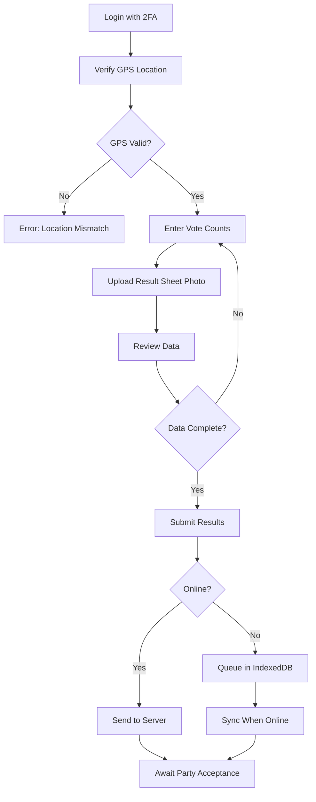

### Ward Approver Flow

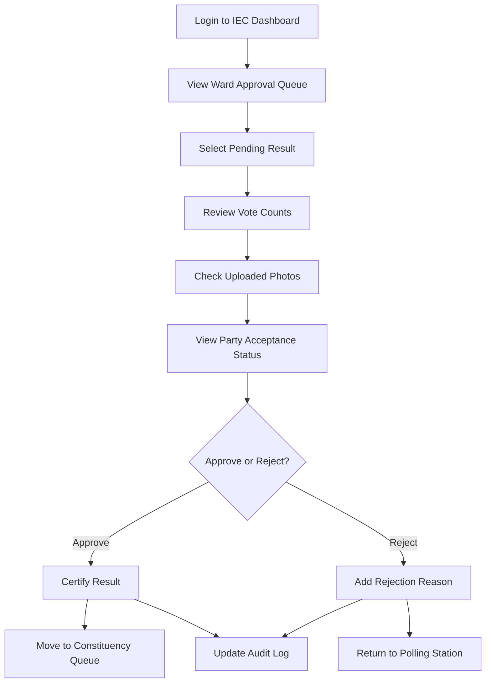

### Constituency Approver Flow

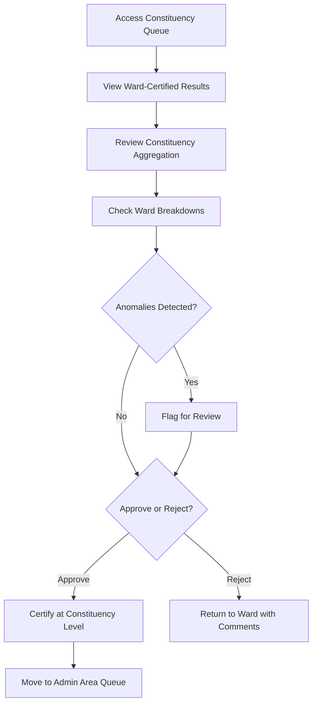

### Party Representative Flow

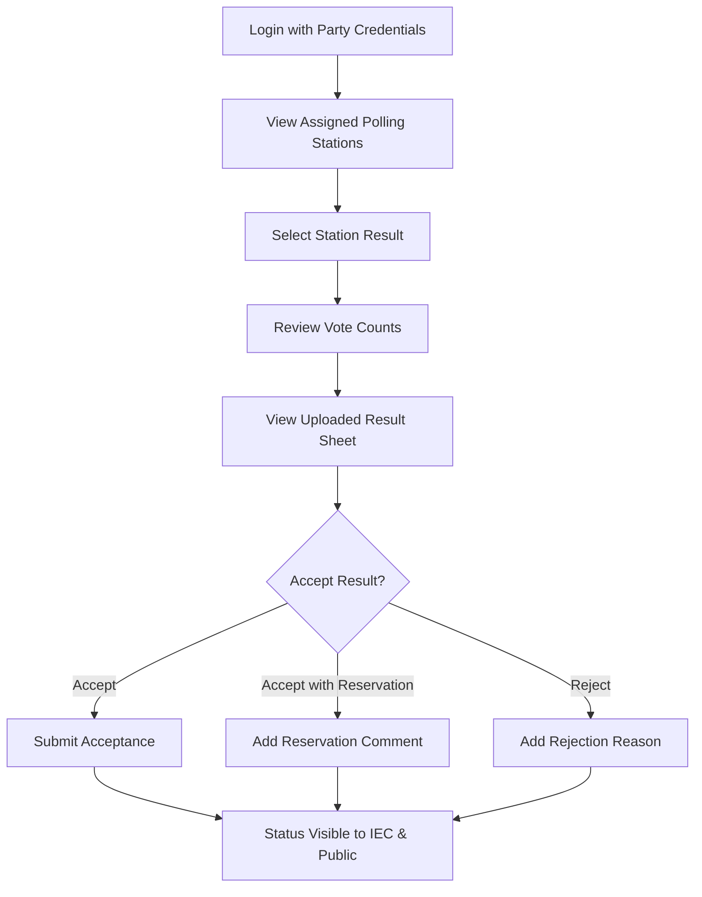

### Public User Flow

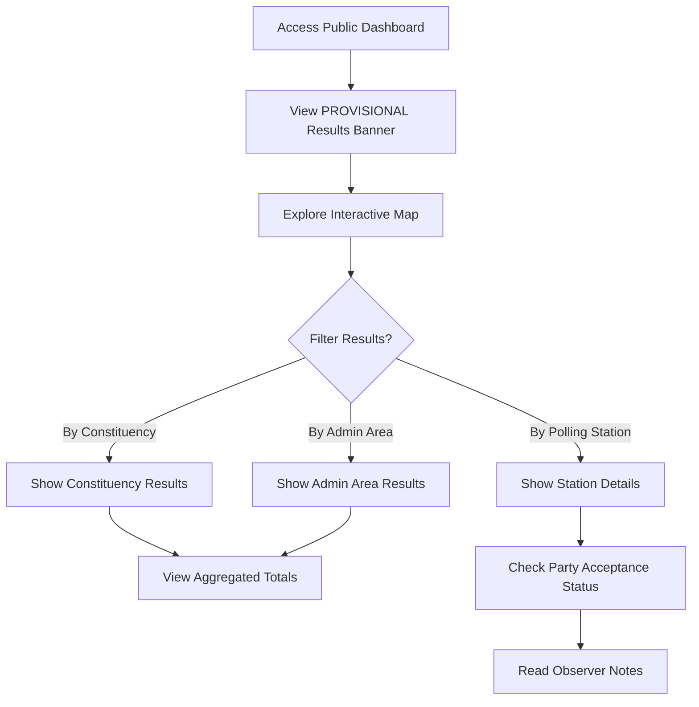

---

## 📋 Sequential Certification Workflow

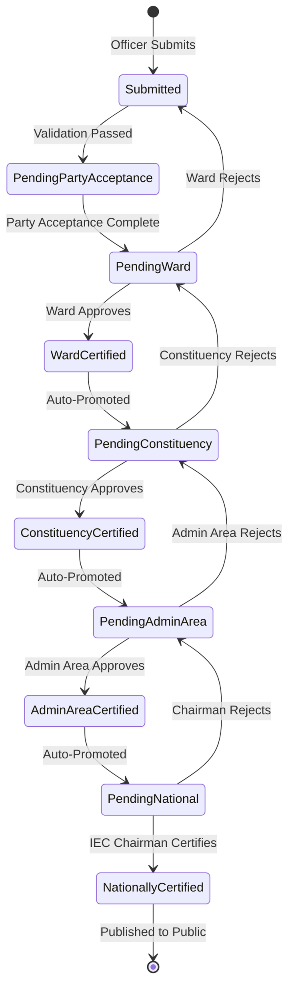

---

## 🏗️ System Architecture

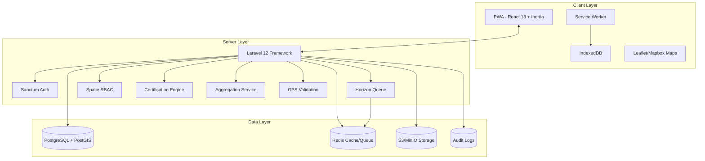

---

## 🗄️ Database Schema

### Core Tables Structure

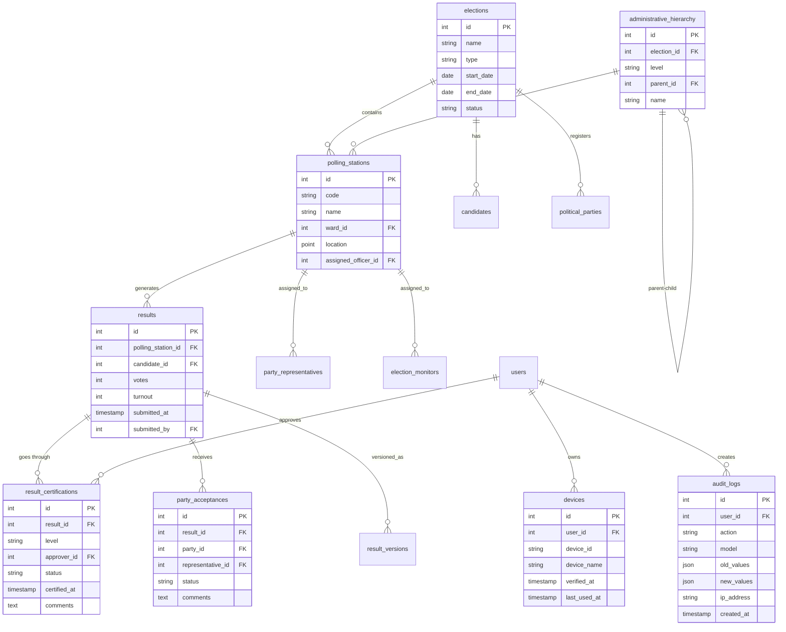

---

## 🔐 Security Architecture

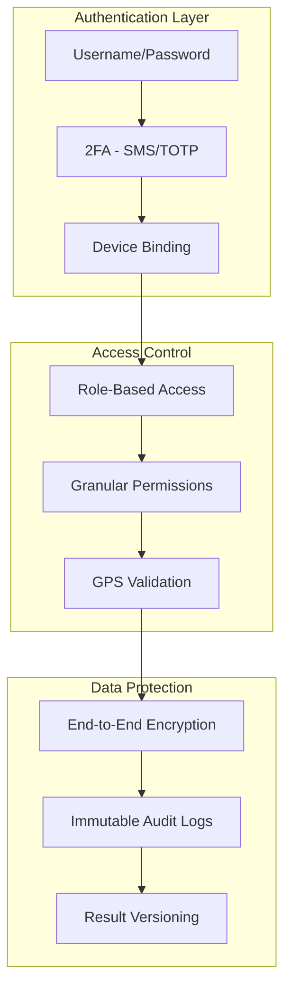

---

## 🚀 Deployment Architecture

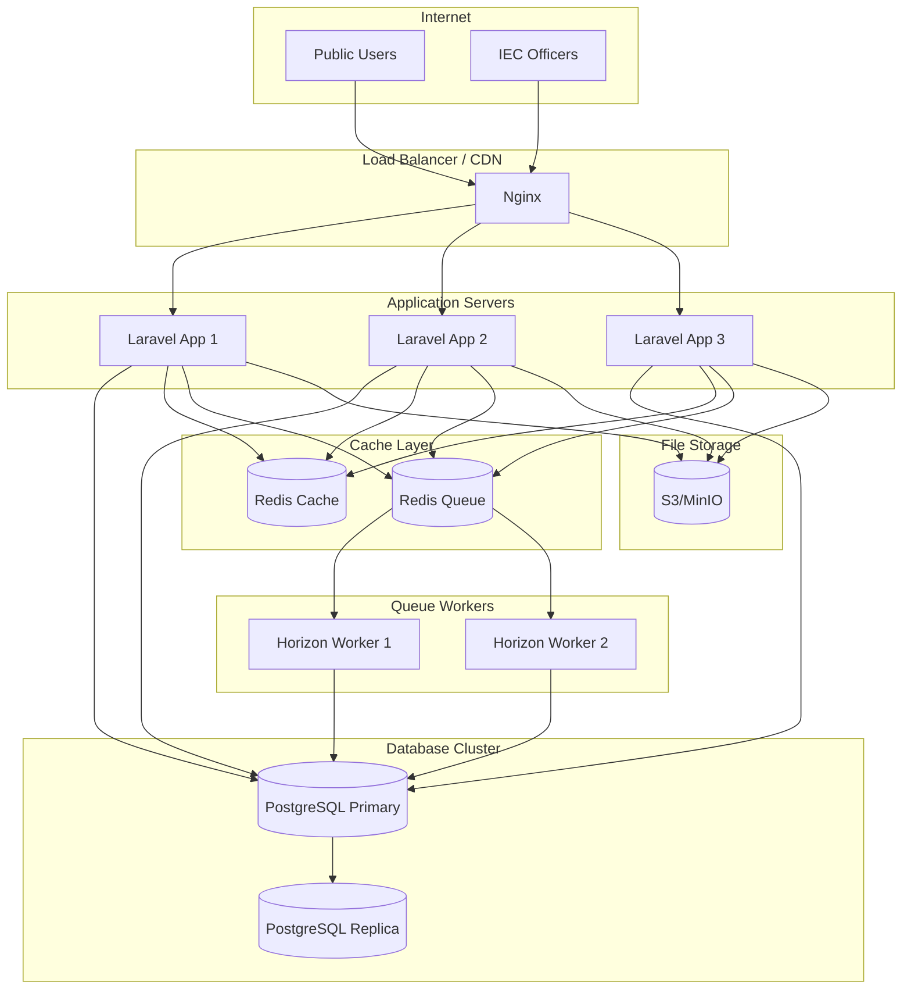

---

## 📱 Offline-First Architecture

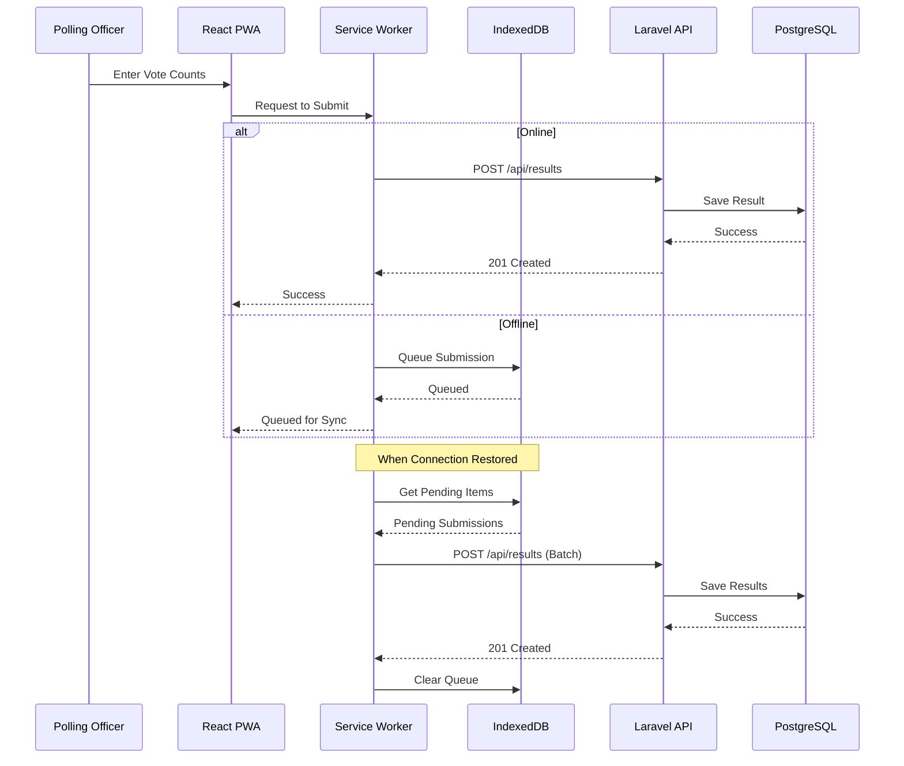

---

## 🎯 Key Implementation Notes

### Laravel 12 Specific Features

1. **Inertia.js Integration**
   - Zero-API SPA architecture
   - Server-side routing with client-side navigation
   - Automatic CSRF protection

2. **Sanctum Authentication**
   - Stateful authentication for web
   - Token-based for mobile/PWA
   - Device-bound tokens

3. **Horizon Queue Monitoring**
   - Real-time queue monitoring
   - Failed job management
   - Performance metrics

4. **Spatie Permission**
   - Role hierarchy (7 roles)
   - Permission inheritance
   - Guard-based access control

### React + Vite Configuration

1. **Offline Support**
   - Workbox service worker
   - IndexedDB for local persistence
   - Background Sync API

2. **State Management**
   - React Query for server state
   - Zustand for client state
   - Inertia's shared data

3. **Performance**
   - Code splitting by route
   - Lazy loading components
   - Image optimization

### PostgreSQL + PostGIS

1. **Geospatial Queries**
   - `ST_Distance` for GPS validation
   - `ST_Within` for boundary checks
   - Spatial indexing on polling station locations

2. **Performance Optimization**
   - Materialized views for aggregations
   - Partial indexes on certification status
   - Query optimization for 100k concurrent reads

---

## 📊 Success Metrics

| Metric | Target | Phase |
|--------|--------|-------|
| System Uptime | 99.9% | Phase 4 |
| Polling Stations Digitally Enabled | 100% | Phase 2 |
| IEC Staff Trained | 200+ users | Phase 4 |
| Offline Sync Success Rate | >95% | Phase 2 |
| Public Dashboard Load Time | <2 seconds | Phase 3 |
| Concurrent Users Support | 100,000 | Phase 3-4 |
| Result Certification Time | <24 hours | Phase 3 |

---

## ⚠️ Critical Risks & Mitigation

| Risk | Impact | Mitigation |
|------|--------|------------|
| **Connectivity Issues in Rural Areas** | High | Offline-first design, robust sync queue, extensive testing with network simulation |
| **Public Misinterpretation of Results** | High | Clear "PROVISIONAL" labeling, public communication campaign, legal disclaimers |
| **Security Breaches** | Critical | 2FA, device binding, GPS validation, penetration testing, immutable audit logs |
| **Insufficient Training** | High | 3-week dedicated training, role-specific materials, pilot test as practice run |
| **Load Performance** | Medium | Load testing for 100k req/min, CDN, auto-scaling, database optimization |
| **GPS Spoofing** | Medium | Multi-factor location verification, device fingerprinting, anomaly detection |