# IEC NERTP - Role-Based Access Control (RBAC) Flow

## Overview of Roles

The system has **7 primary roles** plus **public users**:

1. **Polling Station Officer** - Submits results from polling stations
2. **Ward Approver** - Reviews and certifies ward-level results
3. **Constituency Approver** - Reviews and certifies constituency results
4. **Administrative Area Approver** - Reviews and certifies admin area results
5. **IEC Chairman** - Final national certification
6. **IEC Administrator** - System configuration and user management
7. **Political Party Representative** - Accepts or disputes results
8. **Election Monitor** - Submits observations
9. **Public User** - Views certified results (no authentication)

---

## RBAC Permission Matrix

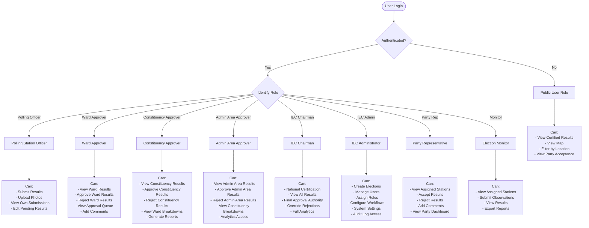

---

## Role Access Hierarchy

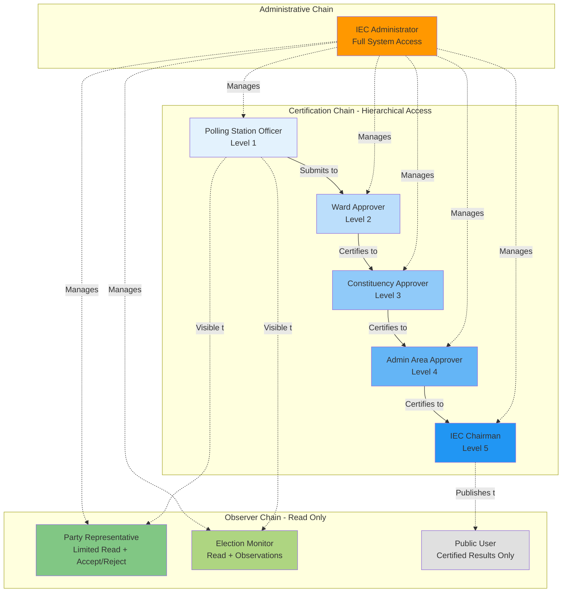

---

## Detailed Permission Flow by Role

### 1. Polling Station Officer Flow

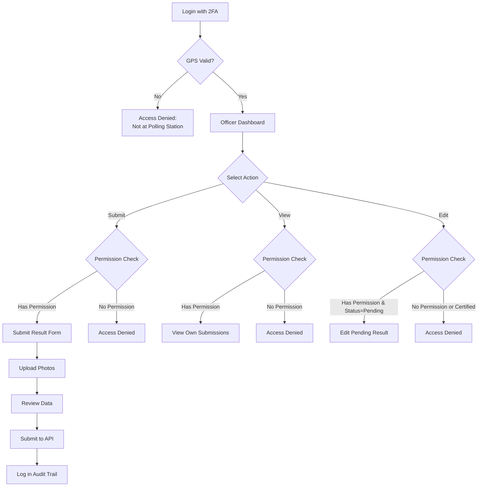

### 2. Ward Approver Flow

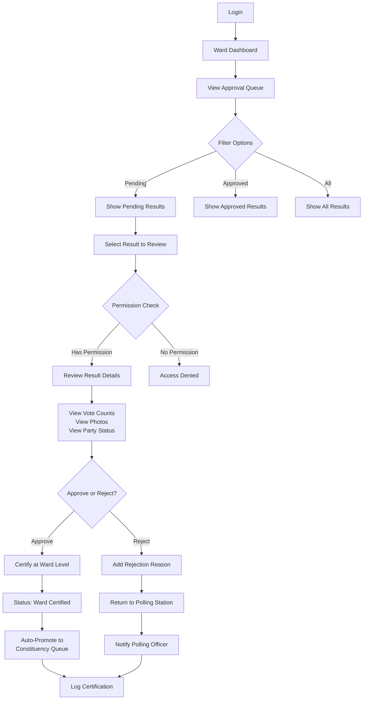

### 3. IEC Administrator Flow

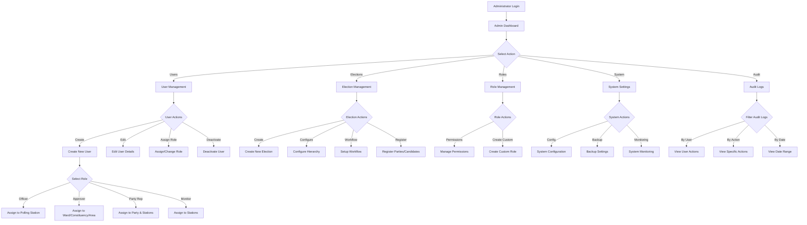

### 4. Political Party Representative Flow

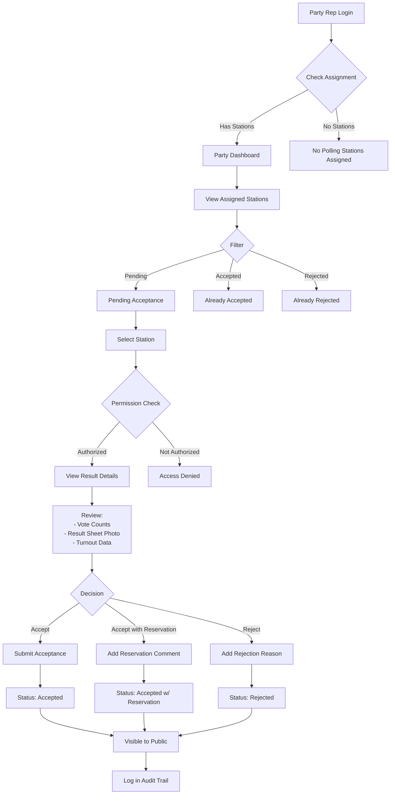

---

## Permission Gates & Middleware

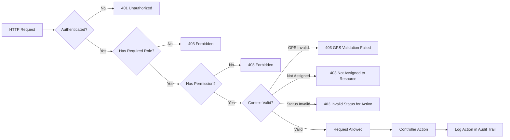

---

## Data Access Control

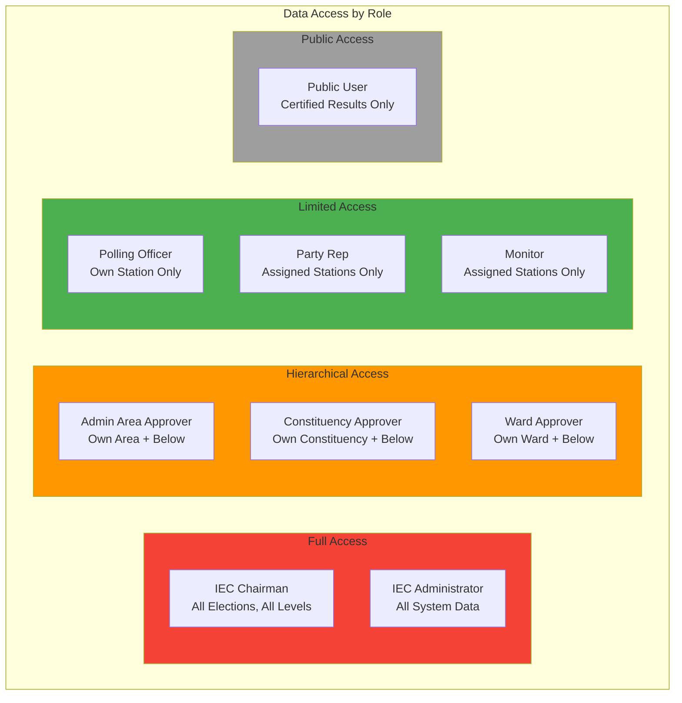

---

## Permission Implementation (Laravel)

### Role Seeder Structure

```php
// database/seeders/RoleSeeder.php

$roles = [
    'polling-officer' => [
        'submit-result',
        'view-own-result',
        'edit-pending-result',
        'upload-photo',
    ],
    
    'ward-approver' => [
        'view-ward-results',
        'approve-ward-result',
        'reject-ward-result',
        'view-ward-queue',
        'add-certification-comment',
    ],
    
    'constituency-approver' => [
        'view-constituency-results',
        'approve-constituency-result',
        'reject-constituency-result',
        'view-constituency-queue',
        'view-ward-breakdowns',
        'generate-constituency-report',
    ],
    
    'admin-area-approver' => [
        'view-admin-area-results',
        'approve-admin-area-result',
        'reject-admin-area-result',
        'view-admin-area-queue',
        'view-constituency-breakdowns',
        'access-analytics',
    ],
    
    'iec-chairman' => [
        'national-certification',
        'view-all-results',
        'override-rejection',
        'final-approval',
        'access-full-analytics',
        'publish-results',
    ],
    
    'iec-administrator' => [
        'create-election',
        'manage-users',
        'assign-roles',
        'configure-workflow',
        'system-settings',
        'view-audit-logs',
        'manage-polling-stations',
        'register-parties',
    ],
    
    'party-representative' => [
        'view-assigned-stations',
        'accept-result',
        'reject-result',
        'add-acceptance-comment',
        'view-party-dashboard',
    ],
    
    'election-monitor' => [
        'view-assigned-stations',
        'submit-observation',
        'view-observation-history',
        'export-observations',
    ],
];
```

---

## Middleware Chain Example

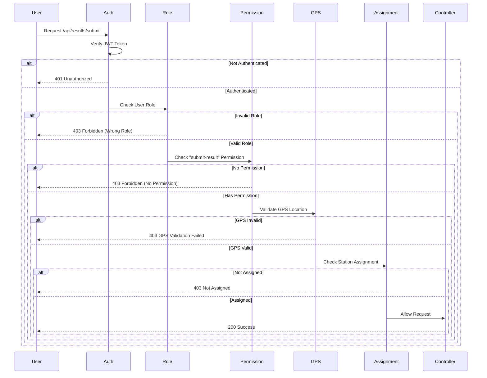

---

## Role-Based UI Rendering

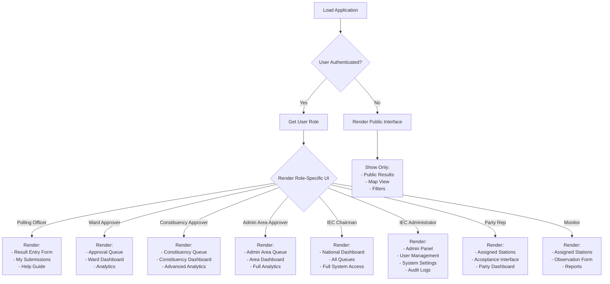

---

## Security Rules Summary

| Role | Authentication | 2FA Required | Device Binding | GPS Validation | Data Scope |
|------|----------------|--------------|----------------|----------------|------------|
| **Polling Officer** | ✅ | ✅ | ✅ | ✅ | Own station only |
| **Ward Approver** | ✅ | ✅ | ✅ | ❌ | Own ward + below |
| **Constituency Approver** | ✅ | ✅ | ✅ | ❌ | Own constituency + below |
| **Admin Area Approver** | ✅ | ✅ | ✅ | ❌ | Own admin area + below |
| **IEC Chairman** | ✅ | ✅ | ✅ | ❌ | All data |
| **IEC Administrator** | ✅ | ✅ | ✅ | ❌ | All system data |
| **Party Representative** | ✅ | ✅ | ❌ | ❌ | Assigned stations only |
| **Election Monitor** | ✅ | ✅ | ❌ | ❌ | Assigned stations only |
| **Public User** | ❌ | ❌ | ❌ | ❌ | Certified results only |

---

## Audit Trail for RBAC Actions

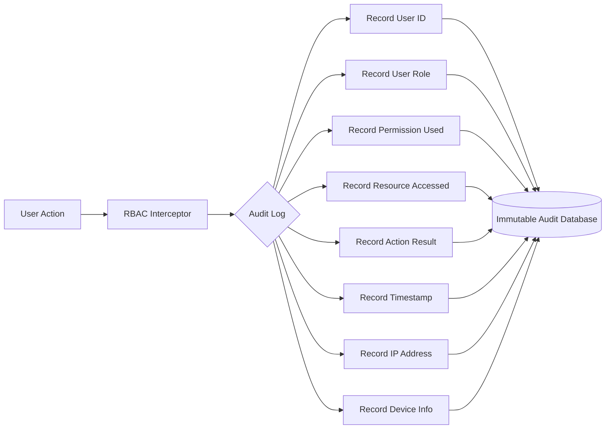